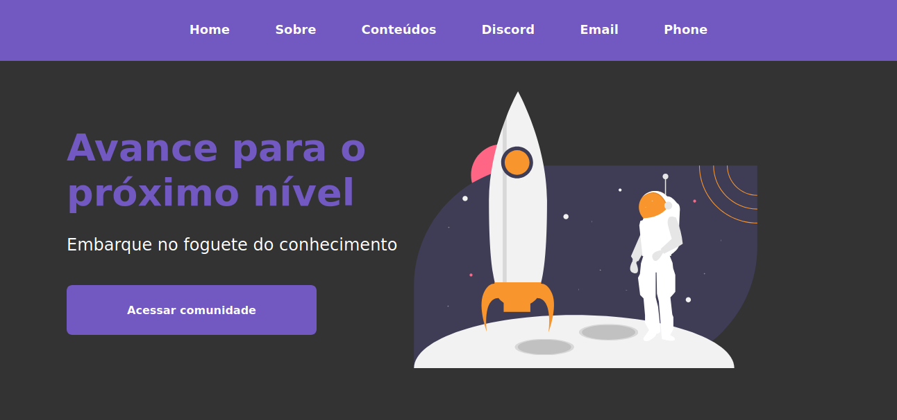
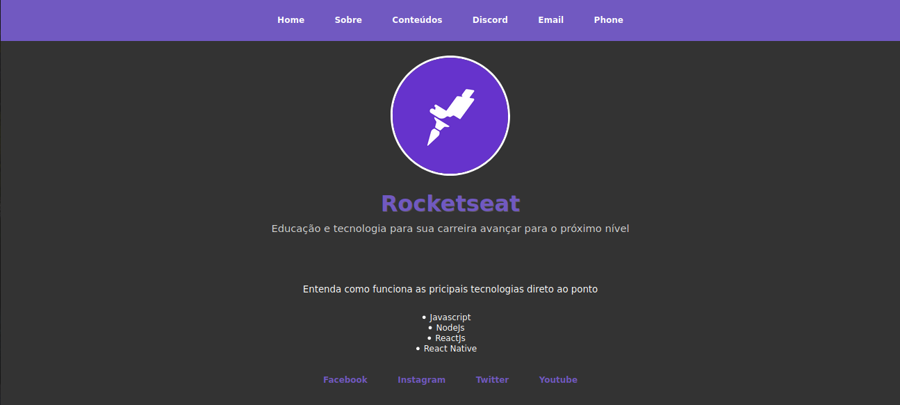
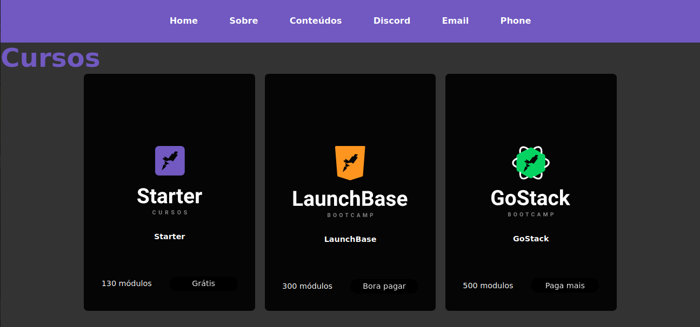

<h1 align="center">
    
</h1>

<h3 align="center">
  Module Challenges 2 - Starting Front end
</h3>

<blockquote align="center">“Challenges of Bootcamp LaunchBase 02”</blockquote>

  

  

  <a href="#rocket-challenges">Challenges</a>&nbsp;&nbsp;&nbsp;|&nbsp;&nbsp;&nbsp;
  <a href="#memo-license">License</a>

## :rocket: Challenges

- First HTML - Challenge 02:1
  

  </img>

- Description page - Challenge 02:2

  </img>

- Courses page and iframe - Challenge 02:3 

Veja funcionando ao vivo: https://challenge2-3.netlify.app/

  </img>

## :memo: License

This project is under the MIT license. See the archive [LICENSE](/LICENSE) for more details.

---

Made by [Wellington Cid](https://linkedin.com/in/wellingtoncid) with [Rocketseat](https://rocketseat.com.br) support
